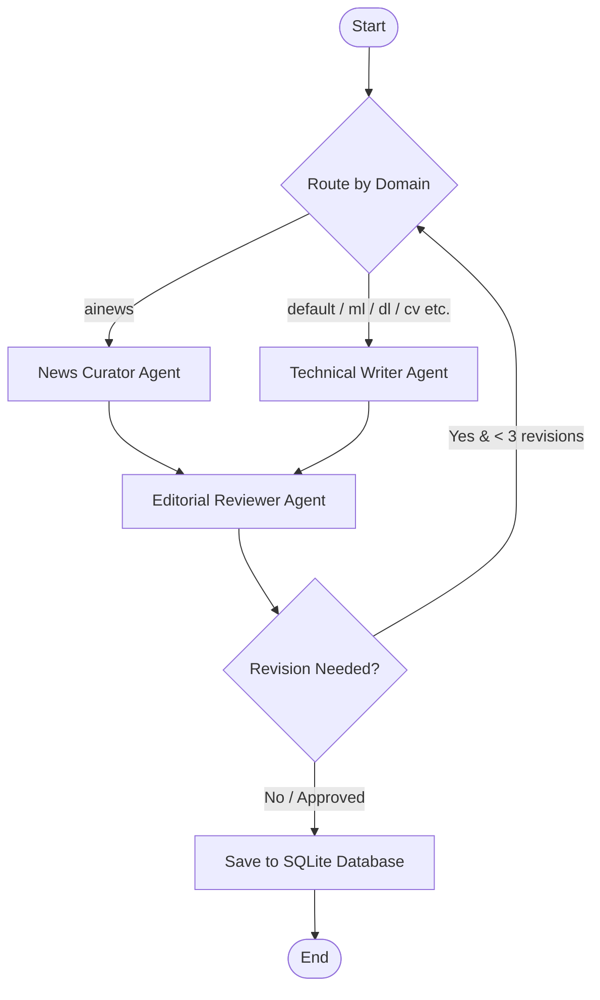

# AgentWire 🌐

AgentWire is an autonomous, multi-agent article and blog post generation engine powered by **LangGraph** and **FastAPI**. It leverages a collaborative team of specialized AI agents (technical writers, news curators, and editorial reviewers) to research, draft, edit, and optimize articles in real time.

---

## Architecture & Workflow

AgentWire utilizes a stateful graph architecture to coordinate agent workflows and handle iterative review loops:



### Agent Roles
1. **Technical Writer (`technical_writer`):** Drafts detailed, deep-dive articles on technical domains (e.g., ML, DL, CV, NLP, statistics).
2. **News Curator (`news_curator`):** Sources active news (specifically for the `ainews` domain), compiles summaries, and aggregates top daily trends.
3. **Editorial Reviewer (`editorial_reviewer`):** Inspects drafts against structural guidelines, SEO friendliness, and quality rubrics. It will either approve the draft or reject it with structured feedback to run a correction loop (capped at a maximum of 3 revision cycles).

---

## Directory Structure

```text
├── agents/                      # Specialized LangGraph Agent Definitions
│   ├── news_curator/            # Sourcing and drafting news articles
│   ├── technical_writer/        # Drafting technical articles
│   └── editorial_reviewer/      # Editorial review, verification, and database saving
├── config/                      # Application Settings & Shared Logger
│   ├── logger.py                # Console formatter and log writer (agentwire.log)
│   └── settings.py              # Pydantic Env configuration loader
├── graph/                       # Graph Core Configuration
│   ├── graph.py                 # Graph building and conditional routing
│   └── state.py                 # Shared state schema (ArticleState)
├── services/                    # Database, LLM and Sourcing Services
├── tools/                       # Sourcing and search integrations (Tavily, Guardian, etc.)
├── main.py                      # FastAPI Web Application & API endpoints
├── run.py                       # Command line interface execution script
├── pyproject.toml               # Poetry dependencies and metadata
└── generate_endpoints_comparison.md # Detailed docs on Sync vs Async endpoints
```

---

## Getting Started

### Prerequisites
* Python $\ge$ 3.12
* [Poetry](https://python-poetry.org/) for dependency management

### Installation

1. Clone the repository and navigate to the project directory:
   ```bash
   cd agentwire-backend
   ```

2. Install dependencies:
   ```bash
   poetry install
   ```

3. Create a `.env` file in the root directory:
   ```env
   GROQ_API_KEY="your_groq_api_key"
   DATABASE_URL="sqlite:///./db"
   
   # Optional API Integrations for Sourcing/Research
   TAVILY_API_KEY="your_tavily_key"
   GUARDIAN_API_KEY="your_guardian_key"
   UNSPLASH_API_KEY="your_unsplash_key"
   SENTRY_DSN="your_sentry_dsn"
   ```

---

## Usage

### 1. Command-Line Interface (`run.py`)
Run the autonomous pipeline directly from your terminal:

```bash
# Generate today's default article (IST)
poetry run python run.py

# Generate for a specific date
poetry run python run.py --date 2026-03-07

# Run in AI News Gathering and Curation mode
poetry run python run.py --ainews

# Preview mode (Dry run - skips external LLM charges and database writes)
poetry run python run.py --dry-run
```

### 2. FastAPI Web API Server (`main.py`)
Launch the REST API server:

```bash
poetry run uvicorn main:app --reload
```
Once started, the API Documentation is accessible at `http://127.0.0.1:8000/docs`.

---

## API Documentation

### Article Generation Endpoints

* **Synchronous Generation (`POST /generate`):**
  * Blocks and waits until the article generation graph completes.
  * *Use case:* Development, debugging, and scripts.
* **Asynchronous Generation (`POST /generate/async`):**
  * Queues the task and immediately returns `202 Accepted` along with a tracking `thread_id`.
  * *Use case:* Production deployment, frontend integrations.

### Database Query Endpoints
* **`GET /articles`:** Lists generated articles stored in the database. Filterable by category (e.g. `?category=ml`).
* **`GET /articles/{slug}`:** Retrieves a specific article by its URL slug.
* **`GET /health`:** Basic service health status checks.

---

## Author & Metadata

* **Project Name:** AgentWire
* **Author:** Siddharth Rai
* **Contact:** raisiddharth1024@gmail.com
