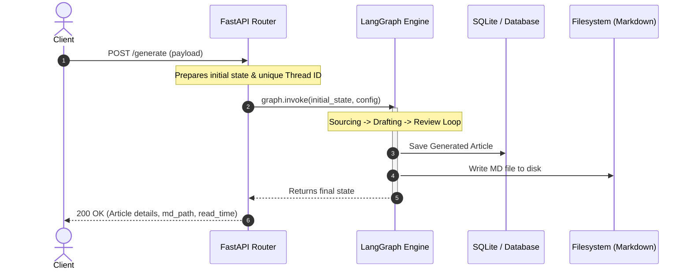
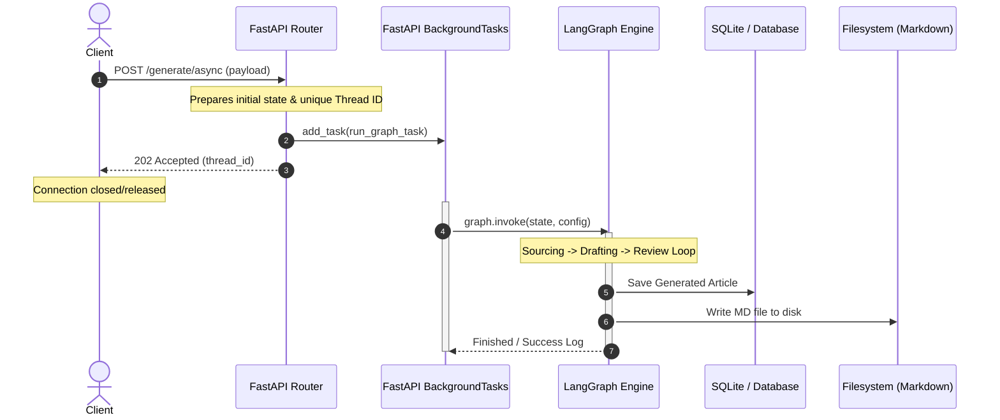

# Comparison: `/generate` vs `/generate/async`

This document provides a detailed technical comparison of the two primary article generation endpoints in the AgentWire Backend: `/generate` (Synchronous) and `/generate/async` (Asynchronous). It explains their mechanics, architectural designs, performance characteristics, and the engineering rationale for implementing both methods.

---

## Executive Summary

The AgentWire multi-agent graph (built using LangGraph) involves external API calls, research sourcing, content generation, and editorial review loops. Because these tasks are computationally expensive and dependent on external LLMs, they can take anywhere from **15 seconds to several minutes** to complete.

To address different execution environments and integration needs:
- **`/generate`** is a **synchronous (blocking)** endpoint designed for scenarios where the client needs immediate feedback and is capable of holding the connection open (e.g., local CLI, scripts, testing).
- **`/generate/async`** is an **asynchronous (non-blocking)** endpoint designed for production environments where gateway/client timeouts are constrained and decoupling generation from the request-response cycle is critical.

---

## Architecture Diagrams

### 1. Synchronous Endpoint (`/generate`)
In the synchronous flow, the connection remains open, and the client waits until the entire LangGraph pipeline completes, reviews the article, saves it to the database, and writes it to the filesystem.



---

### 2. Asynchronous Endpoint (`/generate/async`)
In the asynchronous flow, the client receives an immediate `202 Accepted` status with a `thread_id`. The actual article generation is queued to run in the background on FastAPI's background thread pool, freeing the client connection.



---

## Comparative Matrix

| Feature | Synchronous (`/generate`) | Asynchronous (`/generate/async`) |
| :--- | :--- | :--- |
| **HTTP Method** | `POST` | `POST` |
| **Status Code** | `200 OK` (Success) or `500 Internal Server Error` | `202 Accepted` |
| **Execution Style** | Blocking (Synchronous) | Non-blocking (Asynchronous Background Task) |
| **Response Time** | High (tens of seconds to minutes) | Near-Instantaneous (~5–50ms) |
| **Response Payload** | Full article metadata (title, slug, md_path, read_time) | Message, Status (`accepted`), and `thread_id` |
| **Error Feedback** | Direct HTTP Error payload with traceback / error description | Logged to file/console (`logger.error`). Client gets `202` regardless. |
| **Gateway Timeout Risk** | **High** (likely to timeout under Nginx, Cloudflare, etc.) | **None** (response sent immediately) |
| **Resource Retention** | Holds HTTP connection worker thread active | Releases connection worker thread immediately |
| **Recommended Use Case** | Testing, debugging, small-batch manual generation, CLI commands | Production API, Web frontends, automated cron schedules |

---

## Detailed Endpoint Breakdown

### 1. Synchronous Route (`/generate`)
Defined in [main.py:94-140](file:///c:/Users/Admin/Desktop/Research%20Agent/agentwire-backend/main.py#L94-L140).

- **Implementation**:
  ```python
  @app.post("/generate", response_model=GenerateResponse, status_code=200)
  def generate_blog(request: GenerateRequest):
      # ...
      try:
          final_state = graph.invoke(initial_state, config=config)
          # ...
          return GenerateResponse(
              message="Article generated successfully!",
              status="completed",
              details={...}
          )
      except Exception as e:
          raise HTTPException(status_code=500, detail=f"Graph execution failed: {str(e)}")
  ```
- **How It Works**:
  1. Captures input payloads such as `domain`, `topic`, `dry_run`, and `date`.
  2. Spawns a synchronous thread ID: `agentwire-sync-{date}-{timestamp}`.
  3. Invokes the graph blocking logic via `graph.invoke(...)`.
  4. If successful, checks if the generation was skipped or completed and replies with `200 OK` along with the file path (`md_path`), slug, title, and estimated reading time.
  5. If the LangGraph execution fails (e.g. LLM rate limit, code exceptions in agents), it immediately raises an HTTP 500 error, giving the client a direct error traceback.

---

### 2. Asynchronous Route (`/generate/async`)
Defined in [main.py:141-175](file:///c:/Users/Admin/Desktop/Research%20Agent/agentwire-backend/main.py#L141-L175).

- **Implementation**:
  ```python
  @app.post("/generate/async", status_code=202)
  def generate_blog_async(request: GenerateRequest, background_tasks: BackgroundTasks):
      def run_graph_task(state_data: dict, thread_conf: dict):
          try:
              logger.info(f"[Async Queue] Starting generation for target: {state_data}")
              graph.invoke(state_data, config=thread_conf)
              logger.info("[Async Queue] Generation complete.")
          except Exception as err:
              logger.error(f"[Async Queue Error] Execution failed: {err}")

      # ...
      background_tasks.add_task(run_graph_task, state, config)
      return {
          "message": "Blog generation task successfully queued in the background.",
          "status": "accepted",
          "thread_id": thread_id
      }
  ```
- **How It Works**:
  1. Captures inputs and creates an async thread ID: `agentwire-async-{date}-{timestamp}`.
  2. Wraps the execution pipeline inside `run_graph_task`, wrapping it in a `try-except` block to capture errors inside the background thread.
  3. Registers the task using FastAPI's standard dependency `BackgroundTasks.add_task()`.
  4. Returns `202 Accepted` immediately. The client knows the task is running because they receive a unique `thread_id`.
  5. The task execution starts in the background. Status, outputs, and errors are outputted to the server logs (e.g., `agentwire.log`) instead of the HTTP response.

---

## Why Both Methods are Necessary

Having both endpoints provides a balanced approach to development, testing, and production operations:

### 1. Developer Experience & Rapid Prototyping (Synchronous)
During active development, it is highly inconvenient to trigger a request, wait, and then inspect log files or check the database to see if the generation worked or why it failed.
- By using the **synchronous `/generate` endpoint**, developers can test prompts, agent feedback parameters, or dry-run states in their browser using Swagger UI (`/docs`), or run automated integration test suites.
- If an agent crashes, the error payload is returned directly in the response body, making local debugging and troubleshooting highly efficient.

### 2. Eliminating HTTP & Gateway Timeouts (Asynchronous)
In real-world deployments, clients connect to APIs through multiple routing layers (Cloudflare, AWS ALB, Nginx, etc.). Almost all of these routing layers enforce strict connection timeouts:
- **Cloudflare** times out requests after **100 seconds** (giving a `524 A Timeout Occurred` error).
- **Nginx** default timeouts are often **60 seconds** (`504 Gateway Timeout`).
- **Browsers/Fetch APIs** often terminate idle connections after **120 seconds**.

If a LangGraph run needs to query search APIs, wait for LLM generations, and undergo 2 or 3 revision iterations by the `editorial_reviewer`, it might take 120–180 seconds. A synchronous connection would timeout, resulting in network errors for the client, even if the backend is still running. The **`/generate/async`** endpoint solves this by separating the client request from the execution cycle.

### 3. Client User Experience (UX)
- In a frontend application (e.g., a dashboard for selecting topics and triggering posts), keeping a loader spinner spinning for minutes on a blocking HTTP request is poor UX. It is fragile, as refreshing the page or a network hiccup will disconnect the socket.
- By using **`/generate/async`**, the dashboard triggers the job, gets a `thread_id`, and immediately displays a progress panel (e.g., *"Generating article in the background... [Thread ID: agentwire-async-...]"*). The user can safely navigate away, and the system can query completed articles via the `/articles` endpoint or a socket to notify them when complete.
